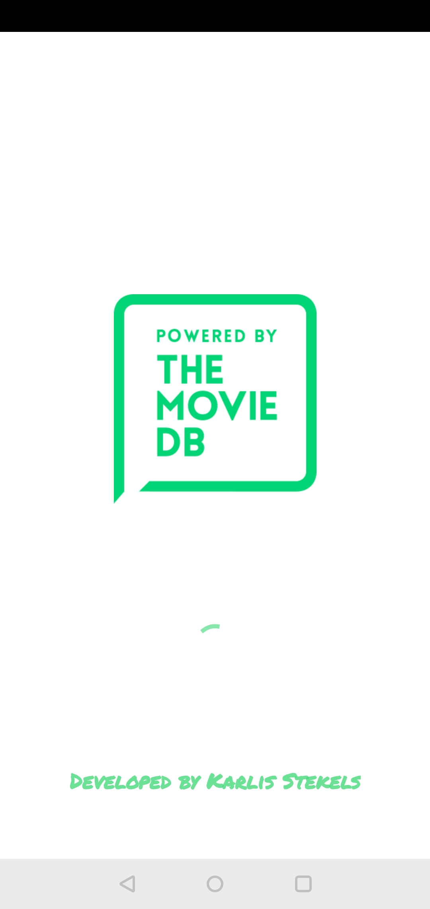

## TMDB Movies Application in Action (Video Presentation - YouTube)

Android Movies Application using Kotlin and The Movies Database Application Programming Interface (TMDB API)

#### Click on Image below!

<td>
<html>
<body>
    <table cellspacing="10">
        <thead>
            <tr>
                <th>Launch Screen</th>
                <th>Main Screen</th>
                <th>Detail Screen</th>
            </tr>
        </thead>
        <tbody>
            <tr>
                <td></td>
                <td></td>
                <td></td>
            </tr>
            <tr>
                <th>Launch Screen(Preview)</th>
                <th>Main Screen(Preview)</th>
                <th>Detail Screen(Preview)</th>
            </tr>
            <tr>
                <td></td>
                <td></td>
                <td></td>
            </tr>
        </tbody>
    </table>
    

    <table cellspacing="10">
        <thead>
            <tr>
                <th>Launch Screen (Light)</th>
                <th>Main Screen (Light)</th>
                <th>Detail Screen (Light)</th>
            </tr>
        </thead>
        <tbody>
            <tr>
                <td></td>
                <td></td>
                <td></td>
            </tr>
        </tbody>
    </table>
    

    <table>
        <thead>
            <tr>
                <th>Youtube (trailer)</th>
                <th>TMDB (Homepage)</th>
            </tr>
        </thead>
        <tbody>
            <tr>
                <td></td>
                <td></td>
            </tr>
        </tbody>
    </table>
    

    <table cellspacing="10">
        <thead>
            <tr>
                <th>Search results</th>
                <th>Search in Action</th>
            </tr>
        </thead>
        <tbody>
            <tr>
                <td></td>
                <td></td>
            </tr>
        </tbody>
    </table>

    <table cellspacing="10">
        <thead>
            <tr>
                <th>Favorites View</th>
            </tr>
        </thead>
        <tbody>
            <tr>
                <td></td>
            </tr>
        </tbody>
    </table>

    <table cellspacing="10">
        <thead>
            <tr>
                <th>Saved Items In SQL DB</th>
            </tr>
        </thead>
        <tbody>
            <tr>
                <td></td>
            </tr>
        </tbody>
    </table>

    <table cellspacing="10">
        <thead>
            <tr>
                <th>Favorite View</th>
                <th>Save Item (Favorites)</th>
            </tr>
        </thead>
        <tbody>
            <tr>
                <td></td>
                <td></td>
            </tr>
        </tbody>
    </table>

    <table cellspacing="10">
        <thead>
            <tr>
                <th>Share Button</th>
                <th>Sharing Options</th>
                <th>Sharing (In Action)</th>
            </tr>
        </thead>
        <tbody>
            <tr>
                <td></td>
                <td></td>
                <td></td>
            </tr>
        </tbody>
    </table>

<h3>APIs and Frameworks</h3>
  <ul>
    <li>
        <a href="https://developers.themoviedb.org/3/getting-started/introduction">The TMDB Movies Database API 3</a>
    </li>
    <li>
        <a href="https://developer.android.com/training/volley">Volley Framework</a>
    </li>
    <li>
        <a href="https://square.github.io/picasso/">Picasso Framework (For Pictures)</a>
    </li>
</ul>

</body>
</html>
</td>
